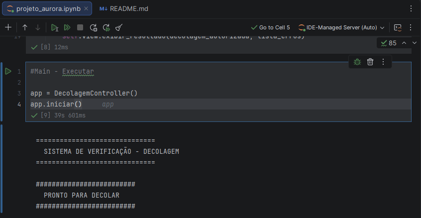
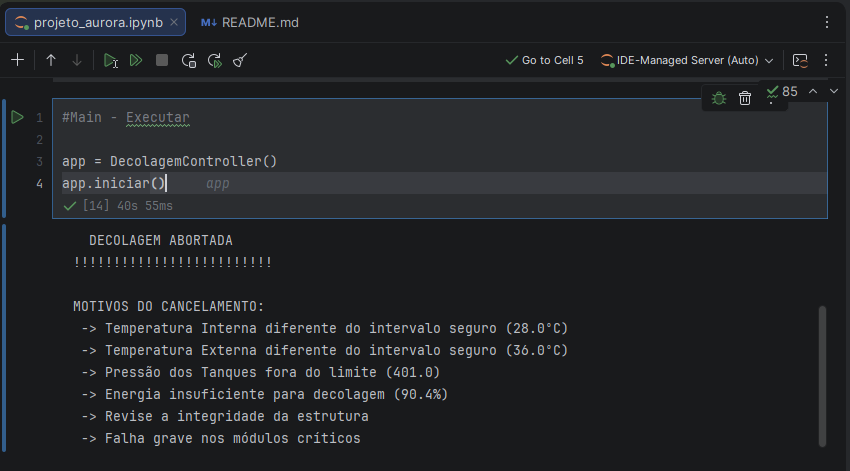

Projeto Criado em Python, organizado em estrutura MVC (Model - View - Controller)

#Apresentação do Projeto - 
    O Projeto Aurora é um sistema desenvolvido em Python para análise e validação de parâmetros críticos em missões aeroespaciais, baseado em dados da NASA. Utilizando arquitetura MVC, o projeto analisa dados de telemetria como temperatura, pressão e energia, aplicando lógica condicional. Nele é incorporado práticas de programação orientada a objetos, tratamento de erros e conceitos de Green IT, visando eficiência, confiabilidade e sustentabilidade tecnológica.

#Instruções para Execução - 
    - Abrir com Jupyter ou IDE de preferência (Projeto criado e testado pelo Pycharm)
    - Executar a última célula: Main
    
          app = DecolagemController()
          app.iniciar()

#Explicação do Código -

    Model: Realiza a parâmetrização e definição dos limites e valida os dados recebidos
    Recebe os dados > Verifica cada condição > Retorna uma lista de erros
    
    View: Responsável pela interação com o usuário, coleta os dados e exibe o resultado
    Coleta Dados do Usuário (Input) > Faz as conversões necessárias > Imprime os dados processados
        
    Controller: Faz o meio campo entre o Model e View
    Aciona o View para coletar dados > Verifica a validade dos dados > Envia os dados para o Model > Decide se pode decolar > Solicita ao View a impressão da decisão de Decolar ou não
    
    Main: Executor do código, um gatilho

    Segue tanto o projeto em .ipynb (\projetoAurora) e em .py (projetoAurora\py)

#Prints da Execução

  DECOLAR

  NÃO DECOLAR

 (Entre parênteses, o valor inserido pelo usuário)
